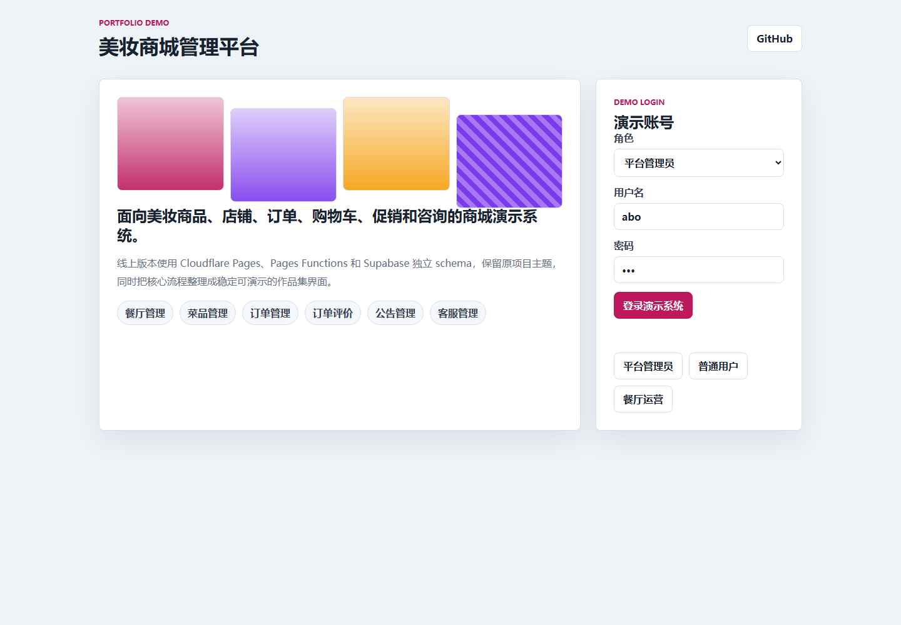
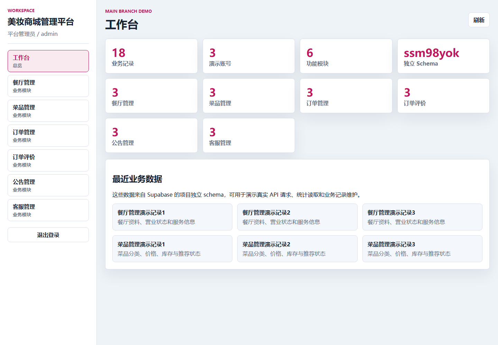
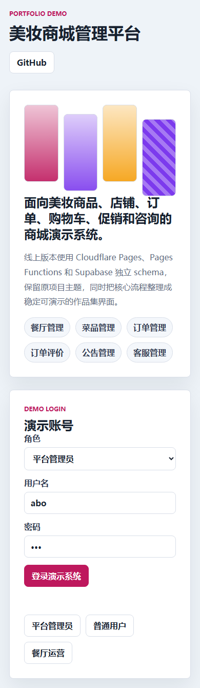

# 美食城小吃自助管理系统

美食城小吃自助管理系统是一个基于 Java SSM、Vue 2 管理端、静态前台页面、CloudBase Run 和 Supabase PostgreSQL 的餐饮小吃自助点餐演示项目，覆盖餐厅展示、菜品浏览、购物车、订单、评价、客服和后台数据维护。


## 在线演示

| 项目 | 地址 |
|---|---|
| GitHub 仓库 | https://github.com/Nemo-netone/ot-ssm98yok |
| 演示首页 | https://ot-ssm98yok.pages.dev |
| 前台入口 | https://ot-ssm98yok.pages.dev/front/ |
| 后台入口 | https://ot-ssm98yok.pages.dev/admin/ |
| 生产分支 | `main` |
| Cloudflare Pages 项目 | `ot-ssm98yok` |
| CloudBase Run 服务 | `ot-ssm98yok-api` |
| Supabase schema | `ot_ssm98yok` |

## 演示账号

| 入口 | 账号 | 密码 | 权限范围 |
|---|---|---|---|
| 后台管理 | `abo` | `abo` | 管理员，可维护用户、餐厅、菜品、订单、评价、公告、客服和轮播配置 |
| 前台用户 | `用户1` | `123456` | 普通用户，可浏览、登录、购物车、订单、评价、地址、收藏和客服 |

演示账号只用于公开功能体验，请不要在演示环境录入真实个人信息、真实地址、真实手机号或其他敏感内容。

## 截图

### 演示首页



### 后台管理



### 移动端前台



## 项目亮点

- 完整链路：Cloudflare Pages 托管前台和管理端静态资源，CloudBase Run 运行 Java SSM API，Supabase PostgreSQL 保存演示数据。
- 数据隔离：线上数据使用独立 schema `ot_ssm98yok`，不占用 `public`，避免影响同一 Supabase 项目里的其他数据。
- 双端演示：前台面向普通用户点餐流程，后台面向管理员做业务数据维护。
- 旧项目现代化部署：原 Eclipse + Tomcat + MySQL WAR 项目被整理为可容器化运行、可公开演示、可持续更新的作品集项目。
- 仓库脱敏：公开仓库只保留占位环境变量、演示数据和非敏感部署记录，不保存平台 token、云密钥或数据库密码。

## 建议体验路径

| 场景 | 入口 | 可验证能力 |
|---|---|---|
| 查看系统门面 | `/` | 项目说明、演示入口、健康检查入口 |
| 前台浏览 | `/front/` | 首页、餐厅信息、菜品信息、公告、购物车、客服入口 |
| 用户登录 | `/front/pages/login/login.html` | 前台用户登录、个人中心、地址、订单和收藏 |
| 后台登录 | `/admin/` | 管理员登录、后台菜单、业务表维护 |
| API 健康检查 | CloudBase `/ssm98yok/health` | 后端服务在线状态 |
| 数据接口 | CloudBase `/ssm98yok/cantingxinxi/list?page=1&limit=1` | Supabase 数据读取和 API 返回 |

## 主要功能

- 餐厅信息：餐厅列表、详情、配送时间、配送服务、电话、地址和介绍。
- 菜品信息：菜品分类、菜品列表、详情、图片、材料、份量、价格和浏览热度。
- 购物流程：购物车、收货地址、订单状态、支付演示、订单评价。
- 用户功能：前台注册登录、个人中心、密码修改、地址管理、收藏管理。
- 互动功能：菜品评论、餐厅评论、客服问答。
- 后台管理：用户、餐厅、菜品分类、菜品信息、订单评价、公告、客服、轮播图、订单状态管理。
- 文件能力：图片上传下载接口和演示图片资源；线上演示使用容器文件系统和仓库内静态演示资源。

## 技术栈

| 层级 | 技术 |
|---|---|
| 前台 | HTML、Layui、Vue 2、jQuery、静态页面 |
| 后台管理 | Vue 2、Vue Router、Element UI、Axios、Webpack、Sass |
| 后端 | Java 8、Spring MVC、MyBatis-Plus 2.3、Druid、Tomcat 9、WAR |
| 数据库 | Supabase PostgreSQL，独立 schema `ot_ssm98yok` |
| 部署 | Cloudflare Pages、CloudBase Run、Docker |

## 项目结构

```text
.
├── src/main/java/com/            # Java SSM 后端 Controller、Service、DAO、Entity
├── src/main/resources/           # Spring、MyBatis、数据库连接配置
├── src/main/webapp/front/        # 前台静态页面
├── src/main/webapp/admin/        # Vue 2 后台管理端源码和构建产物
├── src/main/webapp/upload/       # 演示图片资源
├── pages-site/                   # Cloudflare Pages 发布目录
├── supabase/migrations/          # Supabase 独立 schema 初始化脚本
├── docs/                         # 部署、功能、账号和截图文档
├── Dockerfile                    # CloudBase Run 容器构建
├── cloudbaserc.json              # CloudBase 项目配置，不含密钥
└── .env.example                  # 本地环境变量占位示例
```

## 本地运行

### 后端

```powershell
mvn -B -DskipTests package
```

本地 Tomcat 运行时保持应用上下文为 `ssm98yok`。后端通过环境变量读取数据库配置，示例见 `.env.example`。

### 后台管理端

```powershell
cd src/main/webapp/admin
npm install --legacy-peer-deps
$env:NODE_OPTIONS="--openssl-legacy-provider"
npm run build
```

当前项目已经把旧版 `node-sass` 替换为 `sass`，并把旧 Sass `/deep/` 写法调整为 `::v-deep`，以便在当前 Node/npm 环境中构建。

### 前台静态页

前台页面位于 `src/main/webapp/front/`。线上演示将前台、后台构建产物和演示上传资源整理到 `pages-site/` 后发布到 Cloudflare Pages。

## 部署说明

当前部署约定：

- 仓库名和 Cloudflare Pages 项目名固定为 `ot-ssm98yok`。
- 首次生产部署分支固定为 `main`，后续继续使用 `main`，保持 `https://ot-ssm98yok.pages.dev` 不变。
- 后端服务名固定为 `ot-ssm98yok-api`。
- Supabase 只使用 `ot_ssm98yok` schema，不写入或重置 `public`。

详细部署事实、环境变量占位符和验证记录见 [docs/deployment.md](docs/deployment.md)。

## 已知限制

- 原始项目年代较早，源码中存在历史编码痕迹；线上核心菜单、登录、列表数据和业务流程已按可演示路径验证。
- 后台管理端依赖 Vue 2、Element UI 和旧 Webpack，构建时会出现 Sass/webpack 兼容性警告，但当前产物可运行。
- CloudBase Run 容器文件系统不适合作为长期文件存储；生产化应接入对象存储。
- 演示数据为样例数据，不代表真实餐厅、用户或订单。

## 许可证

本项目采用 PolyForm Noncommercial License 1.0.0。允许非商业学习、使用、修改和分享；商业使用需要获得作者单独授权。

## 2026-07-11 Pages Worker 恢复部署

原 CloudBase Run 后端已出现 503、CORS 或资源隔离问题。线上演示已切换为 Cloudflare Pages Worker + Supabase 独立 schema：

- Pages 项目：`ot-ssm98yok`
- 稳定地址：https://ot-ssm98yok.pages.dev
- Supabase schema：`ot_ssm98yok`
- API：`/health`、`/api/login`、`/api/summary`、`/api/items/*`
- 数据：3 个公开演示账号、18 条业务记录
- 验证：全部账号登录、summary、列表、创建、更新、删除清理和 Playwright 登录前后视图均通过

原 Java/Vue/SSM 源码继续保留；兼容层只负责稳定的公开作品集体验。

